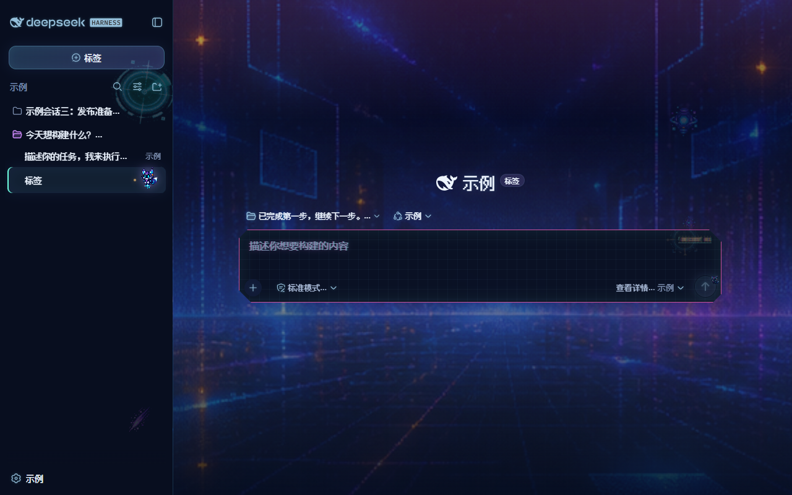
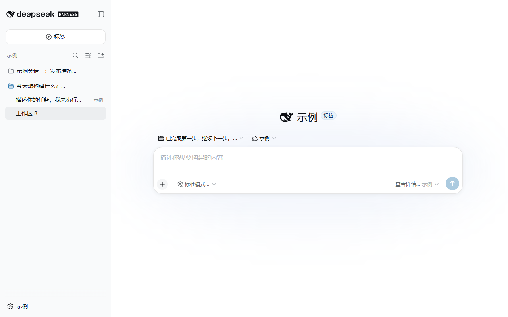

# dsh-skin-digital-arcade · Rizen Signal Console

DeepSeek Harness Web GUI 的数码电玩风 HUD 皮肤（独立分发 bundle）。

它不是单纯换颜色——是一套完整的交互系统：**光标锁定、输入解码、气泡扫描、按钮命中、HUD 扫描、可自由摆放的详情浮窗**。编辑器文字始终保持在官方渲染路径上，可读性优先。

## 预览

| 暗色模式 | 亮色模式 |
|---|---|
|  |  |

## 交互反馈

皮肤的核心是"页面像游戏界面一样回应你"。按 元素 — 触发 — 反馈 列出：

| 元素 | 触发 | 视觉反馈 |
|---|---|---|
| 按钮 / 链接 / 下拉框 | hover | 青色提亮 + 青紫双重光晕 + 轻微上浮（链接与按钮共用此规则） |
| 按钮 / 链接 / 下拉框 | 按下 | 变琥珀色 + 下沉（命中确认） |
| 按钮 / 链接 / 下拉框 | 键盘聚焦 | 品红色瞄准框 |
| 未选中标签页 | hover | 品红—琥珀色扫描线划过 |
| 对话气泡 | hover | 顶部扫描线 + 文字短暂 chromatic glitch（数据读取动画） |
| 输入框 | 聚焦 | 显示 `INPUT // DECODE 01` 状态标签、边框脉动、文字 RGB 分离与短暂乱码 |
| 输入框 | 输入中 | 低频 typed glitch（每 4.6s 闪一次 RGB 分离） |
| 发送按钮 | 常驻 | 狐狸精灵 sprite 持续播放 + 青色光晕 |
| 发送按钮 | hover | 光晕增强 + 能量 atlas 帧动画 |
| 发送按钮 | 按下 | 能量帧爆发 + 整个输入卡 send burst 扩散 |
| 底部统计条 | 常驻 | 雷达旋转 + 横向扫描线（游戏 HUD 状态条） |
| Session Log / 后台任务 / 活动标签 | 常驻 | 各自挂载 data-core / data-shard 精灵（非随机漂浮装饰） |
| 侧边栏选中项 | 常驻 | 青色边缘 + 琥珀色状态信标脉冲 |
| 侧边栏 | 常驻 | 雷达 / 粒子动画 |
| hero 标题 | 常驻 | 青紫辉光脉动 |

## 特性

- **霓虹配色**：青色 `#6fffe0` / 紫罗兰 `#d28cff` / 品红 `#ff62bd` / 琥珀 `#ffc36b`
  的赛博 HUD 语言，替代默认蓝金
- **像素字体**：Fusion Pixel 12px（OFL-1.1，latin + 简体中文子集，覆盖全 CJK 常用字）
  用于按钮、标题、标签；英文数字与中文统一 12px 像素网格，混排协调
- **动画 HUD**：背景网格漂移、hero 光晕脉动、侧边栏雷达/粒子、选中项状态信标、
  输入卡扫描线、发送能量帧动画、气泡悬停 chroma 扫描、底部 HUD 状态条
- **像素资产**：程序化生成的 arcade 城市背景、数据核心/碎片精灵、
  信号吉祥物 sprite sheet、能量 FX atlas、十字准星光标（全部 WebP 压缩）
- **自定义光标**：十字准星（32×32）应用于可交互元素，文本输入处恢复文本光标
- **可读性优先**：编辑器文字保持官方渲染路径；对话正文系统字体；
  输入框静态网格 + 底部扫描线（无干扰动画）
- **设置面板兼容**：打开设置时临时提升侧边栏层级并解除裁剪，
  保证遮罩和面板完整显示（无 `backdrop-filter`，fixed 面板保持全视口）

## 详情浮窗（可自由摆放的窗口）

Think（思考）、工具输出（pwsh 等）和代码详情都是**独立的浮动窗口**，可以像桌面小挂件一样
自由摆放，互不干扰。这样你就能一边把代码窗口放在旁边，一边读中间的回复。

| 操作 | 行为 |
|---|---|
| 点击窗口 | 该窗口提到最上层，叠放的窗口能看清哪一个是当前窗口（高亮边框 + 提升的层级） |
| 拖动标题栏 | 自由移动窗口；落位按 8px 网格吸附，同一行的窗口自动对齐；松手后位置被记住 |
| 拖动窗口空白处 | 同上，拖动结束自动固定，且窗口不会被拖出页面 |
| 拖动边缘 / 角 | 自由缩放（最小 196×120）；缩放结果同样被记住 |
| 图钉按钮 | 固定／取消固定（取消固定只解除「保持打开」，**不会**把窗口弹回原位） |
| 最小化 / 最大化 | 最小化停靠到两侧任务栏；最大化只占据输入框上方的区域，不会盖住输入框 |
| 新开窗口 | 自动级联偏移 28px，多个窗口不会完全重叠成一摞 |
| 回复里的代码块 | 点击代码块的标题栏（横幅）弹出为浮窗，再点一次还原；浮窗状态下拖动标题栏可移动。`复制` 按钮不受影响 |

**对话列宽度完全不变**：窗口是浮层，打开／拖动／缩放窗口都不会改变对话正文的宽度或位置，
所以正文永远不会被挤扁。窗口之间也不会互相推动——每个窗口只管自己。

> 该运行时由本皮肤的客户端半体提供（见「原理」），与 Harness 个人主题补丁共用同一份代码；
> 两者同时存在时会自动让位一份，不会重复注册监听器。

## 更新记录

### v0.2.3

- **修复：从左边或上边拉伸时，另一侧会跟着动**。此前 west/north 拖动只改宽度、
  不动位置，于是窗口以**被拖的那条边**为锚，导致对面的边跟着跑。现在位置会吸收尺寸变化，
  **没被抓住的那条边保持不动**；并且触到最小尺寸时，被拖的一侧也同步停住
  （此前宽度停住了、边还在继续滑）
- **修复：最大化不是「正居中」**。上一版把基准取成了**视口中心**（`50vw`），
  但左侧边栏占了 280px，所以相对**对话区**是偏左的（1480px 视口下偏左 140px）。
  现在运行时发布对话区几何（`--dsh-stage-centre` / `--dsh-stage-width`），
  最大化以对话区为基准居中，并**填满**对话区（此前被限制在 820×560，
  在 1200px 宽的对话区里根本不算最大化）
- 工程：README 补充说明样式改动的构建顺序（`skin.css` 必须先经 `build:lib:client`
  再到 `build:web`，dist 消费的是 `ui-theme/lib/styles/`）

### v0.2.2

- **新增：回复里的代码块也能弹出浮窗**。以前只有工具输出（Think / pwsh / diff / read / search /
  web 卡片）能弹出窗口，回复正文里的 ``` 代码块完全没有这个能力。现在点击代码块的标题栏
  （横幅）即可弹出为浮窗、再点一次还原；浮窗状态下拖动标题栏可移动，边缘可缩放，
  点击可切层级，和其它窗口完全一致
  - 标题栏右侧有 `⧉ 浮窗` / `⧉ 还原` 提示；`复制` 按钮保持自己的手势，不会被误触
  - 实现上**不往 React 的 DOM 里插节点**（会被下次重渲染清掉），而是让状态走属性、由样式读取；
    代码块本身留在 React 树里，所以高亮、复制、选中全部照常工作
- **修复：横幅布局被挤歪**。提示标签改为脱离文档流定位，不再作为 flex 的第三个子项 ——
  否则 `space-between` 会把 `复制` 按钮挤到横幅正中间
- **修复（工程）**：`skin.css` 的改动在只跑前端构建时不会生效 —— dist 消费的是
  `ui-theme/lib/styles/` 下的产物。生成与构建顺序已修正（先生成、再 `npm run build`）

### v0.2.1

- **修复：浮窗内长文本不换行难以阅读**。diff 卡片的行此前是 `white-space: pre` +
  横向滚动（刻意设计，因为折叠源码行会破坏缩进）。现在**浮窗内**改为换行并带悬挂缩进
  （续行对齐到文字而非 `+`/`-` 号），正文流内仍保持 `pre`，宽栏下横向滚动更合适
- **修复：最大化不再贴在页面顶部**，改为在输入框上方的区域内**居中**
- **修复：拖到页面下方不再自动缩小**。高度上限此前是按窗口自身位置算的
  （`输入框顶部 − 窗口顶部`），所以往下拖就变小；现在上限属于页面，
  位置由「不越过输入框」的下界来保证
- **修复：窗口不再被拖到输入框上面**，拖动时会被挡在输入框上方
- **修复：最大化后无法还原**。工具条读取最大化状态的监听器挂在了一个
  「面板还没渲染就返回」的 effect 上（面板经 body portal 晚一个 commit 出现），
  导致状态永远不同步、按钮标签不翻转。同时这也意味着
  `dsh-panel-resized` / `dsh-panel-moved` 两个监听器此前**从未生效**
- **缩放判定区从 8px 加大到 14px**，边缘更容易抓取
- 资源路径生成器不再硬编码 Harness 路径（可传参），并新增资源缺失审计

### v0.2.0

- **新增：详情浮窗窗口管理器**（本皮肤首次提供客户端半体）：自由拖动、边缘缩放、
  点击切层级、按网格吸附、新窗口级联、图钉固定、任务栏最小化、不遮挡输入框的最大化
- **修复：窗口不再挤压对话**。此前主题会按窗口宽度给对话加内边距避让，
  窗口拖宽时正文章节会被压到一列一个字；现在窗口是纯浮层，对话列宽恒定
- **修复：拖动后尺寸／高度不再静默回弹**（此前 `--dsh-panel-max-height` 只被读取、
  从未被写入，松手后会被上下限压回）
- **修复：最大化不再盖住输入框**（改为占据输入框上方区域，并按实测输入框高度留位）
- **修复：取消固定不再把窗口瞬移回初始位置**；窗口也无法再被拖出页面
- **修复：面板正文恢复可选中复制**（拖动改为只从标题栏／空白处发起）
- **修复：上下文占用面板的主题样式从未生效**（旧选择器里是构建期生成的哈希类名，
  已改为稳定属性 `data-dsh-context-meter`）
- 页面修复：死选择器清理、窗口层级变量化（`--dsh-panel-z`）
- 工具链：`skin.css` 与客户端源码均由生成器产出，路径不再硬编码

### v0.1.1

- **侧边栏会话树像素化**：工作区名、会话标题、分组标签（如「工作区」）统一像素字体，
  时间戳 / 状态标签使用小号像素字
- **全 CJK 像素字体**：改用 Fusion Pixel 12px（覆盖简体中文常用字），
  英文数字与中文保持同一 12px 像素网格
- **预览图更新**：基于真实页面捕获 + 占位文本重制（不含任何真实数据）

### v0.1.0

- 初始发布：霓虹 HUD 主题、像素字体、动画精灵、交互反馈、自定义光标

## 安装

插件本体是 JavaScript + CSS + 静态资源，**无需单独编译**。

```sh
# 从 GitHub 安装
dsh plugin --profile web add https://github.com/RizenHNT/dsh-skin-digital-arcade

# 或从本地目录安装
dsh plugin --profile web add /path/to/dsh-skin-digital-arcade
```

> 若使用 Harness **源码版 CLI**（`pnpm dsh ...`），需先按官方文档构建 Harness；
> 安装版 CLI（`dsh`）不需要。

安装或更新后**建议重启**当前 `dsh web` 进程，确保新的 bundle、资源路由和 index 注入全部加载：

```sh
dsh --profile web
```

## 卸载

```sh
dsh plugin --profile web remove dsh-skin-digital-arcade
```

卸载即移除路由与注入，页面恢复默认主题。

## 原理

- `cordis.patch.yml` 插入一行 host 插件 `skin-digital-arcade`
- `index.js`（host 半体）在 apply 时：
  1. 注册 `/skin-assets/*` 前缀路由，服务包内字体/精灵图（含路径穿越防护）
  2. tap index 渲染，把 `skin.css` 内联进 `<head>`（`data-plugin` 标记）
- `lib/client.js`（**客户端半体**，由 `package.json` 的 `dsh.client` 自动发现）：
  挂载详情浮窗的窗口运行时——拖动、缩放、点击切层级、级联、输入框避让与任务栏。
  它是纯 DOM 代码、不依赖任何 Harness 包，通过页面全局标记
  `__dshArcadeWindowRuntime` 与 Harness 个人主题补丁互斥，避免重复注册监听器
- `skin.css` 是声明层：覆盖 `--dsw-*` 令牌 + 稳定 DOM 属性，
  不触碰编辑器布局属性；窗口几何一律走 `--dsh-panel-*` 变量

## 开发

```sh
# 插件自检：host 半体（资源路由、路径穿越防护、CSS 注入）
node test-plugin.mjs

# 插件自检：客户端半体（在 jsdom 中加载 lib/client.js，驱动真实 DOM 事件）
node test-client.mjs

# 两个自检一起跑
npm test

# 从 Harness 个人主题重新生成 skin.css
python tools/gen-skin-css.py [path/to/harness]

# 从 Harness 个人主题重新生成客户端源码，然后打包
node tools/gen-skin-client.mjs [path/to/harness]
node build.mjs
```

> `tools/gen-skin-css.py` 与 `tools/gen-skin-client.mjs` 以 Harness 源码树中的
> `personal.css` 和 `ui-theme/src/client/index.ts`（哨兵注释
> `arcade-window-runtime` 之间的区块）为输入。**使用本仓库现成的
> `skin.css` / `lib/client.js` 无需运行它们**；仅在同步上游改动时使用。
> `src/client/index.ts` 是生成产物，不要手改。

## 许可

- 本仓库代码、素材包装与文档：**MIT**（见 [LICENSE](LICENSE)）
- 像素字体 **Fusion Pixel** © TakWolf：**OFL-1.1**（见 [assets/fonts/OFL-fusion-pixel.txt](assets/fonts/OFL-fusion-pixel.txt)）
