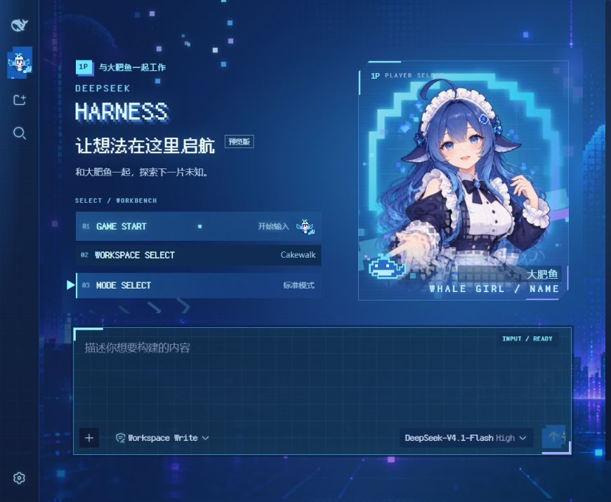
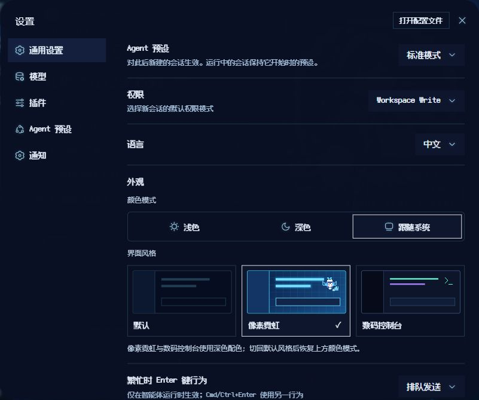
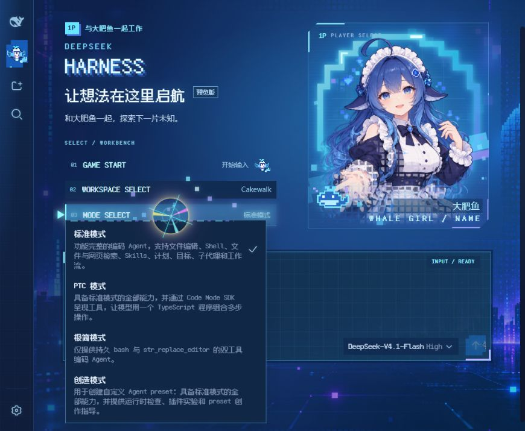
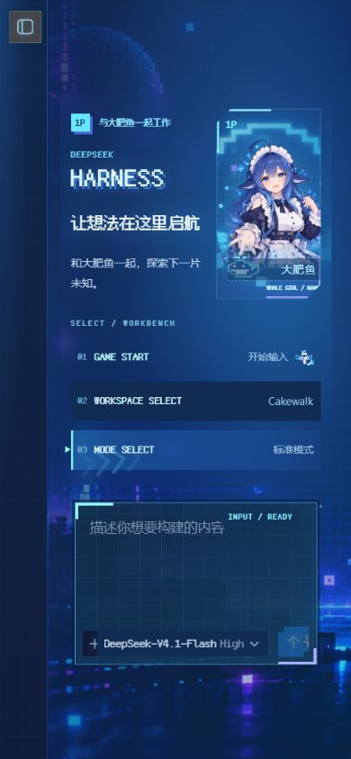
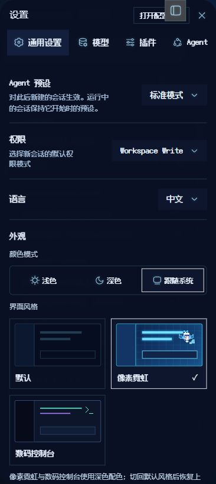

# Digital Arcade · 像素霓虹工作台

DeepSeek Harness Web GUI 的可选外观：以深蓝色为底，用像素人物、青蓝霓虹、街机菜单与粒子反馈装饰日常 AI 工作界面。对话、代码与输入控件保留 Harness 的功能。



> 上图及下方新截图来自应用当前 Git 开发版源码集成的实际页面。**完整工作台需要源码集成补丁**；仅安装普通皮肤插件不会获得全部主页菜单和统计 HUD。固定 [v0.3.2 发布包](https://github.com/RizenHNT/dsh-skin-digital-arcade/releases/tag/v0.3.2) 不包含后续的外观设置整合。

## 展示

### 外观选择



颜色模式保留浅色、深色与跟随系统。界面风格单独选择默认、像素霓虹或数码控制台；数码控制台由可选插件提供，未安装时不显示。两种自定义风格使用深色配色，切回默认后恢复记住的颜色模式。

### 03 · MODE SELECT



首页菜单使用 Harness 的现有控件：**01 GAME START** 聚焦输入，**02 WORKSPACE SELECT** 选择工作区，**03 MODE SELECT** 选择新会话的 Agent 预设。模式列表随 Harness 的预设配置变化；运行中的会话保留开始时的预设。

### 手机布局

<table>
  <tr>
    <td align="center"></td>
    <td align="center"></td>
  </tr>
  <tr><td align="center">手机首页</td><td align="center">手机外观设置</td></tr>
</table>

截图说明见 [preview/README.md](preview/README.md)。公开截图隐藏会话列表，不包含私人对话正文、密钥或远程主机地址。静态截图仅展示动画中的一帧。

## 安装方式与功能范围

| 使用方式 | 提供的内容 | 要求 |
|---|---|---|
| 普通皮肤插件 | 可选像素霓虹样式、本地字体和精灵、光标反馈、详情浮窗 | 已安装 Harness Web GUI；无需单独编译本插件 |
| 完整工作台源码集成 | 首页 01/02/03、鲸鱼娘人物卡与名字输入、页面转场、输入区网格、会话统计 HUD、整合后的外观设置 | 指定 Harness 源码基线、补丁与前端构建 |
| 可选数码控制台 | Rizen Signal Console 编辑器风格，作为独立的界面风格卡片 | 先完成当前 Git 版源码集成，再安装配套控制台插件 |

### 普通插件安装

```sh
dsh plugin --profile web add https://github.com/RizenHNT/dsh-skin-digital-arcade

# 或安装已下载的本地目录
dsh plugin --profile web add /path/to/dsh-skin-digital-arcade
```

安装或更新后，重启当前 Web 服务并刷新页面，在设置 → 外观中选择「像素霓虹」。启动时继续使用原来的数据目录、配置、监听地址与端口；源码版 CLI 需先按 Harness 官方文档完成构建。安装插件不会自动应用源码补丁。

卸载命令：

```sh
dsh plugin --profile web remove dsh-skin-digital-arcade
```

卸载移除插件的资源路由与注入。完整工作台的源码修改需要通过集成前的源码备份单独回退。

### 完整工作台源码集成

补丁针对 Harness 源码基线 `23e3144f405dcb60d9f5231ffe649b8d8af394a6`。先备份当前源码与会话数据，并确认正式服务使用的数据目录。在本皮肤仓库中执行：

```sh
# 只检查兼容性，不写入 Harness
node tools/apply-harness-integration.mjs /path/to/deepseek-harness

# 检查通过后应用，脚本保留被修改源码的备份
node tools/apply-harness-integration.mjs /path/to/deepseek-harness --apply
```

补丁检查失败会停止；不会覆盖冲突改动。脚本应用前端呈现代码并复制本地素材，不读取、迁移或删除 `$DSH_HOME`，不修改模型凭证。源码备份位于 Harness 的 `.tmp-design/arcade-backup-<timestamp>`。

随后在 Harness 源码目录中构建：

```sh
pnpm install
pnpm run build:lib:client
pnpm run build:web
```

保存可回退的前端版本后，使用原启动配置重启 Web 服务。构建证据来自现有定制源码环境；其他 Harness 版本或新安装环境仍需确认补丁兼容性与构建结果。该补丁不含会话存储或模型适配器修改。

数码控制台的安装条件和使用方法见 [配套插件说明](harness-integration/code-console/README.md)。它位于 [harness-integration/code-console](harness-integration/code-console)，仅适用于已应用当前集成补丁的 Harness。

## 视觉与交互

- **蓝色霓虹**：深蓝场景、青蓝光轨与边框，紫色作为点缀；输入区与会话区域用网格、像素角标和 HUD 保持层次。
- **像素元素**：Fusion Pixel 按钮和标题、鲸鱼鳍／喷水／尾鳍头像、人物卡的像素轮廓与局部粒子；对话正文保持可读。
- **动态反馈**：街机菜单指示、页面转场、光标粒子、聚焦扫描与发送反馈。装饰不替代输入、权限或模型选择控件。
- **统计 HUD**：完整源码集成将现有会话统计呈现为游戏式指标；数值来自 Harness，皮肤不生成或改写统计数据。
- **自定义称呼**：鲸鱼娘尚无官方名字，默认称呼为「鲸鱼娘」。人物卡名字框允许自定义，最多 24 个字符，只保存在当前浏览器，不改 AI 人设或对话日志。截图中的「大肥鱼」是自定义示例。
- **详情浮窗**：思考、工具输出与代码详情可拖动、缩放、固定、最小化或最大化；窗口叠放不压缩对话正文，最大化保留输入区。

## 数据与远程访问

皮肤的字体、图片与脚本通过本地插件资源路由加载，不需要 CDN、遥测或额外模型调用。资源路由包含路径穿越防护。界面风格由 Harness 设置保存；自定义称呼仅在当前浏览器保存，换设备后需单独设置。

手机或 Tailscale 访问应连接保存正式会话的同一个实例。测试实例使用不同数据目录时，不会显示正式会话。更换端口或启动服务时保留原来的 `$DSH_HOME`，不要用空数据目录替换现有工作库。

Tailscale Serve 可将私有 tailnet HTTPS 代理到本机 loopback Web 服务。Harness 启动参数需同时声明准确的 `--trusted-host <tailnet-hostname>` 和 `--trusted-origin https://<tailnet-hostname>`；不使用通配符或关闭请求信任检查。首次远程访问可在设置中选择界面风格。

## 开发

插件通过 [cordis.patch.yml](cordis.patch.yml) 注册 host 半体，由 [index.js](index.js) 提供本地资源路由与 CSS 注入；[lib/client.js](lib/client.js) 提供客户端外观控制和浮窗运行时。客户端与个人主题补丁通过共享标记避免重复注册窗口监听器。

```sh
# 插件 host 和客户端自检
npm test

# 修改客户端源码后重新打包
node build.mjs

# 从定制 Harness 同步生成产物（仅维护时需要）
python tools/gen-skin-css.py /path/to/harness
node tools/gen-skin-client.mjs /path/to/harness
node build.mjs
```

[src/client/index.ts](src/client/index.ts) 是生成产物，不直接手改。使用已提供的 CSS 与客户端 bundle 无需运行生成器。历史修复与版本说明见 [CHANGELOG.md](CHANGELOG.md)。

## 素材与许可

- 本仓库代码、素材包装与文档采用 [MIT](LICENSE)。
- Fusion Pixel © TakWolf，字体采用 [OFL-1.1](assets/fonts/OFL-fusion-pixel.txt)。
- 人物插画基于用户提供的鲸鱼娘参考素材，由图像工具补全；像素头像为项目 SVG。原素材保留。
